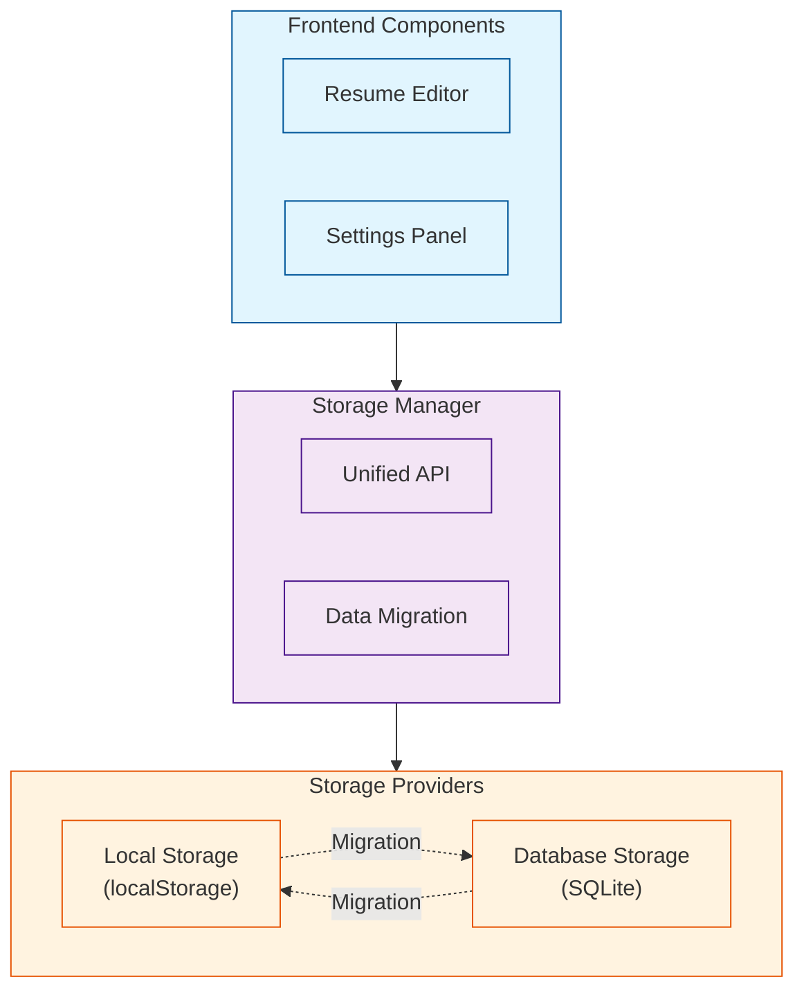

# Nuxt Resume Editor

A modern, feature-rich resume editor built with Nuxt 3, supporting dual storage modes, GitHub authentication, Markdown editing, theme switching, and export functionality.

## 🌟 Features

### 🔐 GitHub Authentication

- Secure GitHub OAuth login for user management
- User-specific resume storage and synchronization
- Automatic user association with created resumes
- Session management with automatic logout

### ✍️ Markdown Resume Editing & Real-time Preview

- Full Markdown syntax support with edit-on-left, preview-on-right layout
- Switch freely between WYSIWYG and source code editing modes
- Enhanced editing experience with paste, formatting, and quick toolbar
- CodeMirror integration for high-performance editing

### 🎨 Multiple Theme Switching

- Built-in beautiful resume themes with instant preview
- Theme styles are independent and extensible
- Theme switching managed by Pinia with auto-persistence
- Custom theme support

### 📤 Export to PDF/Image/ZIP

- One-click export to PDF with automatic multi-page pagination
- Export to high-resolution PNG images
- ZIP packaging for multi-page resumes
- Powered by jsPDF, html-to-image, and jszip

### 📷 ID Photo Upload & Management

- Upload ID photos (JPG/PNG, up to 5MB)
- Drag, scale, and reset photos directly in preview area
- Photo position and scale persistence across theme switches

### 🔤 Font Selection & Customization

- Built-in multiple Chinese and English fonts
- Custom font upload support (ttf/woff/otf)
- Instant font changes with export preservation
- On-demand font loading for performance

### 🌍 Internationalization (i18n)

- One-click switch between English and Chinese UI
- Auto browser language detection
- Based on vue-i18n

### 📱 PWA Support

- Installable as desktop/mobile app
- Offline functionality
- Automatic static resource caching
- Update notifications

### 💾 Dual Storage Mode System

- **Local Storage**: Browser-based, no server required
- **Database Storage**: SQLite-based with multi-device sync
- Seamless switching between storage modes
- Automatic data migration

### 🔌 Plugin & Extensibility

- Plugin system for features like icon insertion, fullscreen, screenshot
- Clean code structure for easy secondary development
- Modular architecture

## 🚀 Quick Start

### 1. Install Dependencies

```bash
pnpm install
```

### 2. Environment Configuration

Create a `.env` file in the project root:

```env
# Auth Configuration
AUTH_SECRET=your-auth-secret-key-here
AUTH_ORIGIN=http://localhost:3000

# GitHub OAuth Configuration
GITHUB_CLIENT_ID=your-github-client-id
GITHUB_CLIENT_SECRET=your-github-client-secret

# Database
DATABASE_URL="file:./prisma/dev.db"
```

### 3. GitHub OAuth Setup

1. Visit [GitHub Developer Settings](https://github.com/settings/developers)
2. Click "New OAuth App"
3. Fill in application details:
   - **Application name**: Nuxt Resume Editor
   - **Homepage URL**: `http://localhost:3000` (development)
   - **Authorization callback URL**: `http://localhost:3000/api/auth/callback/github`
4. Click "Register application"
5. Copy **Client ID** and **Client Secret** to `.env` file

### 4. Generate AUTH_SECRET

```bash
openssl rand -base64 32
```

### 5. Database Setup

```bash
# Generate Prisma client
npx prisma generate

# Create database migration
npx prisma migrate dev --name init

# Optional: View database
npx prisma studio
```

### 6. Start Development Server

```bash
pnpm dev
```

Visit: [http://localhost:3000](http://localhost:3000)

## 📱 Usage Guide

### Main Pages

- **`/`** - Home: Feature introduction, quick guide, theme preview
- **`/resumes`** - My Resumes: Manage your resumes (requires login)
- **`/edit`** - Editor: Main editor with Markdown on left, real-time preview on right
- **`/signin`** - Login: GitHub OAuth authentication
- **`/settings`** - Settings: Storage mode and other preferences

### Authentication

- Sign in with GitHub to save and manage your resumes
- All resumes are automatically associated with your account
- Secure session management with automatic logout

### Export Functionality

- Click "Export PDF" button in top right to export resume
- Supports PDF, PNG export (multi-page resumes are zipped)
- Exported content matches preview with custom themes and fonts

### ID Photo Management

- Click "ID Photo" button in right toolbar to upload
- Drag/scale/reset photo in preview area after upload
- Position and scale persist across sessions

### Font Customization

- Select font in toolbar for instant preview and export updates
- Supports custom font files (ttf/woff/otf)

### Theme Switching

- Click "Theme" button in toolbar to choose style
- Theme selection is saved and restored on next visit

### Storage Mode Management

- Access `/settings` to switch between storage modes
- **Local Storage**: Browser-based, no server required
- **Database Storage**: SQLite-based with multi-device sync
- Automatic data migration when switching modes

### Internationalization

- Switch between English and Chinese in bottom right corner
- Auto-detects browser language

### PWA Features

- Supports "Add to Home Screen" and offline use
- Auto-detects new versions and prompts for update

## 🏗️ Technical Architecture

### Core Technologies

- **Nuxt 3 + Vue 3**: SSR and static deployment support
- **GitHub OAuth**: Authentication with Auth.js
- **Prisma ORM**: SQLite database management
- **Pinia**: State management with persistence
- **CodeMirror + Markdown-it**: High-performance Markdown editing and parsing
- **UnoCSS**: Atomic CSS for performance and flexibility
- **PWA**: Workbox for offline and caching

### Storage System Architecture



### Key Dependencies

- [Nuxt 3](https://nuxt.com/) & [Vue 3](https://vuejs.org/)
- [@sidebase/nuxt-auth](https://sidebase.io/nuxt-auth/) authentication
- [@auth/prisma-adapter](https://authjs.dev/reference/adapter/prisma) database adapter
- [Prisma](https://www.prisma.io/) ORM
- [Pinia](https://pinia.vuejs.org/) state management
- [CodeMirror](https://codemirror.net/) editor
- [Markdown-it](https://github.com/markdown-it/markdown-it) parser
- [UnoCSS](https://uno.css)
- [jsPDF](https://github.com/parallax/jsPDF) PDF export
- [html-to-image](https://github.com/bubkoo/html-to-image) image export
- [jszip](https://github.com/Stuk/jszip) ZIP packaging
- [vue-i18n](https://vue-i18n.intlify.dev/) i18n
- [@vite-pwa/nuxt](https://vite-pwa.nuxtjs.org/) PWA support

## 🔧 Development

### Project Structure

```
DualMode-ResumeEditor/
├── app/                    # Main application code
│   ├── components/        # Vue components
│   ├── composables/       # Composables and providers
│   ├── pages/            # Nuxt pages
│   ├── stores/           # Pinia stores
│   └── templates/        # Resume templates
├── server/               # API routes
├── prisma/              # Database schema and migrations
├── public/              # Static assets
└── types/               # TypeScript type definitions
```

### Adding New Features

1. **Storage Provider**: Implement `IStorageProvider` interface
2. **Database Model**: Modify `prisma/schema.prisma` and run migrations
3. **API Routes**: Add new endpoints in `server/api/`
4. **Components**: Create Vue components in `app/components/`

### Custom Storage Logic

```typescript
// Create custom storage provider
export class CustomStorageProvider implements IStorageProvider {
  // Implement interface methods
}

// Register in storage manager
const customProvider = new CustomStorageProvider()
```

## 🔍 Troubleshooting

### Database Connection Issues

1. Check `DATABASE_URL` in `.env` file
2. Ensure `npx prisma generate` has been run
3. Verify database file permissions

### Authentication Problems

1. Verify GitHub OAuth app configuration
2. Check `AUTH_SECRET` and `GITHUB_CLIENT_SECRET` in `.env`
3. Ensure callback URL matches GitHub app settings

### Storage Mode Issues

1. Check localStorage permissions for local mode
2. Ensure database service is running for database mode
3. Review error messages in browser console

### Export Failures

1. Check browser compatibility
2. Verify font files are accessible
3. Ensure sufficient memory for large exports

## 🔒 Security Considerations

- All sensitive information stored in environment variables
- Use HTTPS in production environments
- Regularly update AUTH_SECRET
- Follow OAuth 2.0 best practices
- Implement proper input validation and sanitization

## 📝 License

[MIT](./LICENSE)

## 🤝 Contributing

Issues, PRs, and suggestions are welcome! For custom development or questions, feel free to contact the author.
