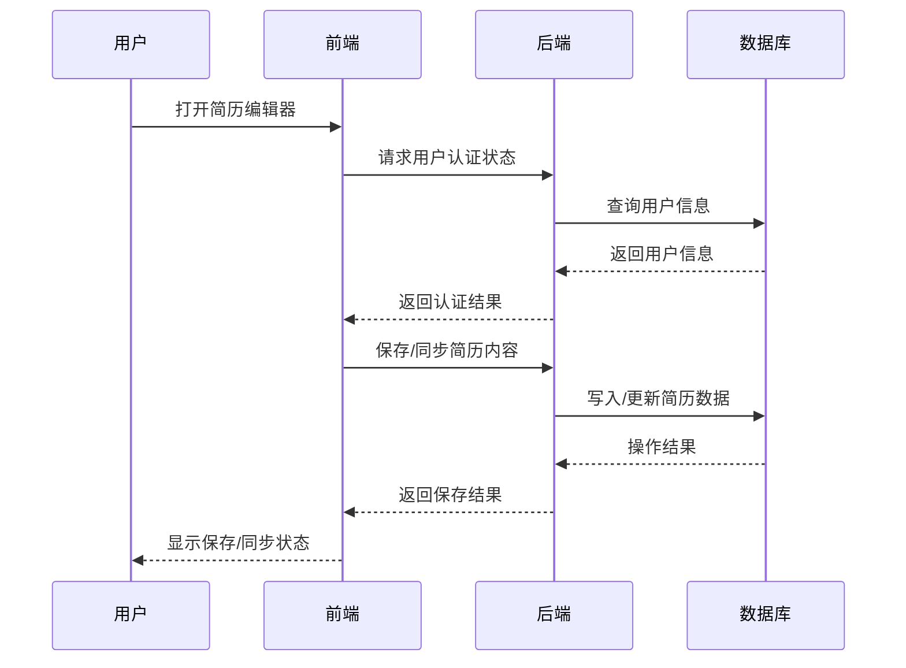

<p align="center">

</p>

<h1 align="center">MARK RESUME</h1>

<p align="center">
<a href="README_US.md"></a><a href="https://resume.ryanuo.cc" target="_blank">

</a><a href="https://github.com/NxResume/nuxt-resume-editor"></a>
<a href="https://ryanuo.cc/zh/posts/resume"></a>
</p>

一个基于 Nuxt 3 & Vue 3 的现代化、功能丰富的简历编辑器，支持 Markdown/WYSIWYG 双模式、GitHub 登录、本地与云端双存储、主题切换、PDF/图片/ZIP 导出、PWA 离线、国际化等特性。

## 🌟 主要特性

- **GitHub/Google/Gitee 第三方登录**，多端同步
- **Markdown 编辑 & 实时预览**，支持所见即所得与源码切换
- **多主题切换**，内置多款美观主题，支持自定义
- **一键导出 PDF/图片/ZIP**，内容与预览一致，适配多页
- **证件照上传与编辑**，支持拖拽、缩放、重置
- **字体选择与自定义上传**，导出时字体无损还原
- **中英文界面一键切换**，自动检测浏览器语言
- **PWA 支持**，可安装为桌面/移动端应用，离线编辑
- **本地/云端双存储**，自动数据迁移
- **插件化架构**，便于二次开发和功能扩展

## ⚙️ 环境变量说明

请根据实际部署环境，参考下方模板创建 `.env` 文件。

| 变量名               | 说明                                       |
| -------------------- | ------------------------------------------ |
| AUTH_SECRET          | Session 加密密钥，建议用 openssl 生成      |
| AUTH_ORIGIN          | 允许的前端地址（如 http://localhost:3000） |
| GITHUB_CLIENT_ID     | GitHub OAuth 应用 Client ID                |
| GITHUB_CLIENT_SECRET | GitHub OAuth 应用 Client Secret            |
| GOOGLE_CLIENT_ID     | Google OAuth 应用 Client ID                |
| GOOGLE_CLIENT_SECRET | Google OAuth 应用 Client Secret            |
| GITEE_CLIENT_ID      | Gitee OAuth 应用 Client ID                 |
| GITEE_CLIENT_SECRET  | Gitee OAuth 应用 Client Secret             |
| DATABASE_URL         | 数据库连接字符串（本地/云端均可）          |
| MAIL_USER            | 邮箱账号（如需邮件功能）                   |
| MAIL_PASS            | 邮箱密码/授权码                            |
| HTTPS_PROXY          | HTTPS 代理（可选）                         |
| HTTP_PROXY           | HTTP 代理（可选）                          |

## 🚀 快速开始

1. 安装依赖

   ```bash
   pnpm install
   ```

2. 配置环境变量（见上文）
   ```bash
   copy .env.example .env
   ```
3. 初始化数据库
   ```bash
   npx prisma generate
   npx prisma migrate dev --name init
   ```
4. 启动开发服务器
   ```bash
   pnpm dev
   ```
   访问 [http://localhost:3000](http://localhost:3000)

## 📖 使用指南

- 首页 `/`：功能介绍、主题预览
- 我的简历 `/resumes`：管理简历（需登录）
- 编辑器 `/edit`：主编辑页面，左侧 Markdown，右侧实时预览
- 登录 `/signin`：第三方登录
- 设置 `/settings`：切换存储模式、偏好设置

## 🏗️ 技术栈

- **前端**：Nuxt 3, Vue 3, Pinia, CodeMirror, Markdown-it, UnoCSS
- **后端/存储**：Prisma ORM, SQLite/PostgreSQL, LocalStorage
- **认证**：@sidebase/nuxt-auth, GitHub/Google/Gitee OAuth
- **导出**：jsPDF, html-to-image, jszip
- **PWA**：@vite-pwa/nuxt
- **国际化**：vue-i18n

## 🖇️ 系统核心流程序列图



## 🤝 贡献与许可

- 欢迎 Issue、PR 与建议，MIT License
- 作者：RYANUO（https://github.com/ryanuo）
